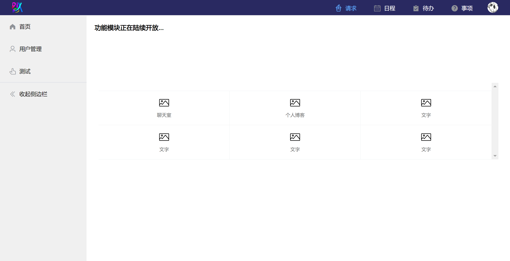

# backstage

## Project setup
```
npm install
```

### Compiles and hot-reloads for development
```
npm run serve
```

### Compiles and minifies for production
```
npm run build
```

# 项目简介
vue+elementui搭建的后台管理系统前端，旨在帮助快速搭建系统后台。

# 页面展示
> 登录页面
> 
> 

> 后台管理主页面
> 